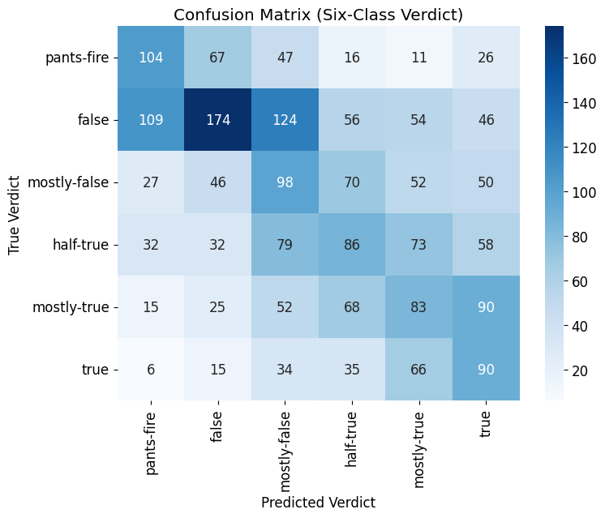

# NLP for Fake News Detection.

We employ a Long Short-Term Memory (LSTM) network trained on the [Politifact](https://www.kaggle.com/datasets/rmisra/politifact-fact-check-dataset/data) fact-check dataset. The Politifact dataset contains texts from news articles, social media, speeches, etc., which have been labelled as varying degrees of true or false: pants-fire, false, mostly-false, half-true, mostly-true, and true. 

## Problem Statement

This project aims to assess how well a deep learning approach based on Long Short-Term Memory (LSTM) networks performs relative to a conventional machine learning model, specifically logistic regression trained on TF-IDF features.

## Stakeholders

This project is highly relevant for companies that may face legal exposure for distributing or hosting false information. By integrating such a model into their content-moderation pipeline, organizations could proactively flag potentially misleading material, reducing the risk of legal action and protecting brand credibility.

## KPIs (Key Performance Indicators)
1. **Accuracy**: measures the overall proportion of correct predictions (both true positives and true negatives) among all samples.

2. **Recall**: quantifies how many of the actual positives were correctly identified. We want high recall to minimize the risk of missing real fake-news cases.

3. **Precision**: measures how many of the samples flagged as positive are truly positive. In some applications, we may tolerate lower precision if our priority is to catch as many fake-news cases as possible, even at the cost of some false alarms.

4. **AUC** (Area Under the ROC Curve): evaluates the model’s ability to distinguish between the two classes across all possible thresholds, with higher AUC indicating better overall separability between true and fake news.

# Project Setup

## DataBase

We use the Kaggle database from [https://www.kaggle.com/datasets/rmisra/politifact-fact-check-dataset/data]( https://www.kaggle.com/datasets/rmisra/politifact-fact-check-dataset/data)

## Data Exploration

The Politifact dataset consists of 21,152 fact-checked statements, spanning 2007 (the year PolitiFact launched) through 2022, with two outlier statements dated 2000 and 2002. Fact-checking volume was low in 2007–2009, increased sharply after PolitiFact won a Pulitzer Prize in 2009, and stayed roughly steady from 2010–2021.

`false` is the most common verdict (5,625 of 21,152 statements). Statements come from thirteen distinct sources, with `news`, `social_media`, and `speech` the most frequent; a disproportionate share of `false`-labeled statements originate from social media.

Statement length (~100 words on average) and stop-word proportion showed little variation across verdicts or sources, ruling both out as useful predictive features on their own. Word- and n-gram-level analysis (167,281 unique bigrams and 221,095 unique trigrams across the corpus) showed the vocabulary is dominated by political figures and topics — "trump," "obama," "percent," "tax," "state" — consistent with the dataset's political fact-checking domain, and motivated using the text content itself (TF-IDF and sequence-based LSTM features) rather than surface statistics like statement length. Full exploratory analysis, including per-verdict word-frequency and n-gram breakdowns, is in `EDA.ipynb`.

## Train/Validation/Test Split and Class Balancing

For each of the three labeling schemes (six-class, three-class, two-class), the data is split 80/10/10 into train/validation/test sets. Because verdict classes are imbalanced (e.g. `false` occurs far more often than `true`), the training set for each scheme is oversampled so every class matches the majority class's count before being combined with the (non-oversampled) validation set for model training.

## Baseline model: Multi-class Logistic Regression

The baseline model uses logistic regression trained on Term Frequency–Inverse Document Frequency (TF-IDF) representations of the news text, which quantify how important each word is within an article relative to the entire dataset. We do not include sentiment-based features in this model, since ["A benchmark study of machine learning models for online fake news detection"](https://www.sciencedirect.com/science/article/pii/S266682702100013X) found that sentiment-based features are not useful in fake news detection. This approach provides a classical linear model that captures correlations between word occurrence patterns and news authenticity.

To compute TF-IDF, we first compute the term-frequency $tf(t,d)$, which is the number of times term $t$ occurs in document $d$. Next, we compute the inverse-document-frequency $$idf(t)=\log{\frac{1+n_d}{1+df(t)}}$$
where $n_d$ is the total number of documents in the corpus, and $df(t)$ is the document frequency of the term $t$ (the number of documents that contain the term $t$). If a word occurs in every document, then the $idf$ of that word is 0. Thus, words that occur in most documents (such as "the", "as", "it") are given very little weight. Finally, the term frequency-inverse document frequency (TF-IDF) is given by:

$$tfidf(t,d) = tf(t,d)\cdot (1+idf(t))$$

## DeepLearning Model: AWD-LSTM

The LSTM model is a deep learning architecture designed to capture long-range dependencies and contextual relationships within sequences of words.It processes each article as an ordered sequence of tokens, allowing the model to learn patterns in language structure and meaning that simpler linear models cannot capture. AWD-LSTM (ASGD Weight-Dropped LSTM) is a regularized variant of the Long Short-Term Memory network designed for efficient language modeling. It introduces weight-dropping (dropout on hidden-to-hidden weights), variational dropout, and NT-ASGD (averaged SGD) optimization to improve generalization. This architecture achieves strong performance on text tasks by combining stability, regularization, and efficient training dynamics.

For each of the three labeling schemes, we fine-tune a pretrained AWD-LSTM (provided by fastai) in two stages:
1. **Language-model fine-tuning** – the pretrained language model is further trained on the Politifact statements (next-word prediction) using the train/validation sets *before* oversampling, so it isn't skewed toward duplicated examples.
2. **Classifier fine-tuning** – the fine-tuned language model becomes the body of a classifier; a new classification head is attached and trained on the oversampled training set.

To improve accuracy, we train three model variants per labeling scheme: a **forward** model (reads the statement in normal order), a **backward** model (reads the statement in reverse order), and a **combined** model that merges the forward and backward models' predictions. This is why each results table below reports the baseline plus all three LSTM variants.

# Results 
We summarize our results in the following tables. The Politifact dataset contains six truth labels: *true*, *mostly true*, *half true*, *mostly false*, *false*, and *pants on fire*. 

We train our classifier under three labeling schemes:

1. **Six labels** – using the original classes.  
2. **Three labels** – *pants on fire* and *false* are grouped as *false*; *half true* and *mostly false* are grouped as *mixed*; and *true* and *mostly true* are grouped as *true*.  
3. **Two labels** – *mostly false*, *false*, and *pants on fire* are grouped as *false*; and *true*, *mostly true*, and *half true* are grouped as *true*.

6-class (Politifact)

| **Metric**        | **LR (TF-IDF)** | **LSTM-forward** | **LSTM-backward** | **LSTM-combined** |
|------------------:|:---------------:|:----------------:|:-----------------:|:-----------------:|
| **Accuracy**      | 0.302           | 0.292            | 0.292             | 0.300             |
| **Precision**     | 0.295           | 0.297            | 0.295             | 0.303             |
| **Recall**        | 0.289           | 0.302            | 0.292             | 0.305             |
| **ROC AUC**       | 0.667           | 0.682            | 0.676             | 0.692             |
| **Running Time**  | 110.65s         | 179.44s          | 244.17s           | 423.61s            |

3-class (Politifact)

| **Metric**        | **LR (TF-IDF)** | **LSTM-forward** | **LSTM-backward** | **LSTM-combined** |
|------------------:|:---------------:|:----------------:|:-----------------:|:-----------------:|
| **Accuracy**      | 0.555           | 0.518            | 0.524             | 0.548             |
| **Precision**     | 0.556           | 0.538            | 0.538             | 0.562             |
| **Recall**        | 0.558           | 0.522            | 0.535             | 0.555             |
| **ROC AUC**       | 0.726           | 0.713            | 0.714             | 0.724             |
| **Running Time**  | 23.05s          | 174.18s          | 251.51s           | 425.69s           |

2-class (Politifact)

| **Metric**        | **LR (TF-IDF)** | **LSTM-forward** | **LSTM-backward** | **LSTM-combined** |
|------------------:|:---------------:|:----------------:|:-----------------:|:-----------------:|
| **Accuracy**      | 0.705           | 0.702            | 0.688             | 0.706             |
| **Precision**     | 0.697           | 0.648            | 0.612             | 0.636             |
| **Recall**        | 0.753           | 0.778            | 0.779             | 0.793             |
| **ROC AUC**       | 0.769           | 0.774            | 0.765             | 0.778             |
| **Running Time**  | 11.76s          | 171.10s          | 250.27s           | 421.37s           |

# Conclusions
For the [Politifact](https://www.kaggle.com/datasets/rmisra/politifact-fact-check-dataset/data) dataset, we obtained comparable values of accuracy, recall, precision, and ROC–AUC for both models — logistic regression and LSTM.  

# Overview of Repository Layout

The Politifact.ipynb notebook contains the code used to analyze the Politifact dataset and to build both the TF IDF model and the AWD LSTM classifier. The EDA.ipynb notebook provides exploratory data analysis for the dataset, including statistics such as the most common words per label, typical article lengths, frequent bigrams and trigrams. The imgs folder stores the figures of the confusion matrices.

# Team Members
This project was developed for 2025 Fall Erdös Institute Deep Learning Boot Camp by:

* Victoria Knapp Perez 
* Jason LaRuez

